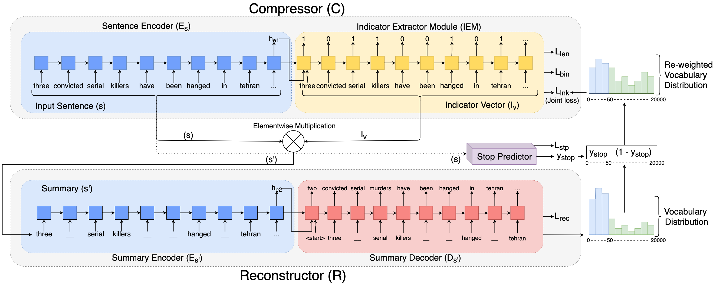

# SCAR: Sentence Compression using Autoencoders for Reconstruction

This is our Keras implementation of the summarization methods described in [Sentence Compression using Autoencoders for Reconstruction](https://aclanthology.org/2020.acl-srw.13/). It features linkage loss which helps drop inferable words, in turn bringing out content aware summary for a sentence.



Table of Contents
=================

  * [Requirements](#requirements)
  * [Quickstart](#quickstart)
  * [Cite](#cite)
  
## Requirements

```bash
virtualenv venv
source venv/bin/activate
pip install -r requirements.txt
```

Training datasets:
- [Gigaword](https://github.com/harvardnlp/sent-summary)
- [Glove embeddings](https://nlp.stanford.edu/projects/glove/)

Evaluate scores on the [DUC2003/DUC2004](https://duc.nist.gov/data.html) datasets.

## Quickstart

### Step 1: Preprocess the dataset

Place the following files in the data directory:
- glove.42B.300d.txt
- train.article.txt
- valid.article.filter.txt

```bash
python preprocess.py $expNo$ 
(Example: python preprocess.py 6)
```

### Step 2: Train the model

Create exp$expNo$ folder (Example: exp6) with a config.json file in it.

```bash
python model.py $expNo$ 
(Example: python model.py 6)
```

### Step 3: Run Inference

```bash
python model.py $expNo$ $sent.txt$ 
(Example: python model.py 6 sents.txt)
```

### Step 4: Evaluate ROUGE scores

To evaluate for rouge, we use [files2rouge](https://github.com/pltrdy/files2rouge), which itself uses
[pythonrouge](https://github.com/tagucci/pythonrouge).

Installation instructions:

```bash
pip install git+https://github.com/tagucci/pythonrouge.git
git clone https://github.com/pltrdy/files2rouge.git
cd files2rouge
python setup_rouge.py
python setup.py install
```

To run evaluation, simply run:
```bash
files2rouge summaries.txt references.txt
```

## Cite

```bash
@inproceedings{malireddy2020scar,
  title={SCAR: Sentence Compression using Autoencoders for Reconstruction},
  author={Malireddy, Chanakya and Maniar, Tirth and Shrivastava, Manish},
  booktitle={Proceedings of the 58th Annual Meeting of the Association for Computational Linguistics: Student Research Workshop},
  pages={88--94},
  year={2020}
}
```